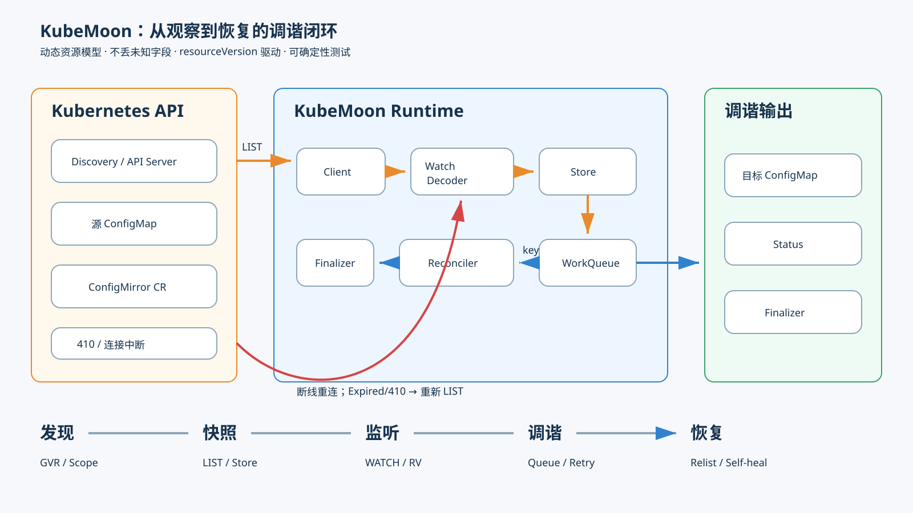

# KubeMoon

这是我基于 MoonBit 开发的 Kubernetes 动态客户端与 Controller Runtime。没有只给某个 YAML 操作包一层，而是补齐 Operator 真正依赖的那条长链：资源发现、动态对象、LIST/WATCH、缓存、去重队列、失败恢复与调谐。

> 当前处于 v0.1 开发期：资源寻址、单份 APIResourceList 解码、in-cluster 凭证、请求构造、状态错误、流式 Watch、Store、WorkQueue、Reflector 和 Fake Transport 已可测试；真实 HTTP 执行器与 ConfigMirror 部署闭环仍在推进。我会在 README 里明确区分“已验证”和“设计目标”。



## 为什么 MoonBit 现在需要 Kubernetes Runtime

Kubernetes 客户端的难点不在发出一个 GET，而在长期运行后还能保持正确：WATCH 可能从任意字节处分块，连接会中断，resourceVersion 会过期，同一对象会在处理中再次变化。KubeMoon 把这些失败路径作为一等设计对象，并用纯状态机与虚拟时间把它们变成快速、确定的测试。

我选择动态资源模型，不要求使用者先生成 OpenAPI 强类型代码。`GroupVersionResource + Scope` 可以覆盖内置资源和 CRD，后续强类型层可在其上渐进构建。

## Discovery：先把一份清单读准确

这一轮我只接住 Kubernetes API Server 返回的一份 `APIResourceList`，例如 core `v1` 或 `apps/v1`。解码结果保留服务端的资源顺序、namespace 作用域、verbs，以及 `singularName`、短名称和分类；必需字段缺失或字段类型错误时，我拒绝整份结果，并指出出错的资源下标，避免动态客户端拿着半份目录继续工作。

我会保留 `deployments/status` 这类子资源，供后续能力判断和请求构造使用，但现在不会为它生成顶层 `GroupVersionResource`。这是有意留下的安全边界：现有路径构造器面向顶层资源，提前复用会掩盖子资源 URL 与 verb 语义的差异。客户端现在能为 core 或 grouped API 构造单份资源清单请求，但还没有枚举 `/api`、`/apis`，也没有缓存或网络执行；这些仍是后续开发项。

## 一个事件如何穿过 KubeMoon

1. `resource` 为任意 GVR 生成 core/group、集群级/namespace 级路径。
2. `client` 加入认证、Accept 与不同 PATCH media type。
3. `watch.Decoder` 跨网络 chunk 缓存半条 JSON，只输出完整事件。
4. `reflector` 用 resourceVersion 更新 `store`；BOOKMARK 只推进进度。
5. `queue` 合并重复 key。处理期间再次变化时，只补一次调谐。
6. 失败进入有上限的指数退避；测试通过显式推进虚拟时钟，不 sleep。
7. 收到 `Expired/410` 时返回 `RELIST`，由外层重新建立快照。

## 现在就能验证什么

```bash
moon fmt --check
moon check --target native --deny-warn --warn-list +73
moon test --target native
```

测试覆盖 core/group 路径、APIResourceList 字段与错误边界、显式 Token 配置、CRUD 请求、Kubernetes Status 分类、任意分块事件、BOOKMARK、快照替换、重复版本、dirty key、退避复位及 410 relist。Fake Transport 会严格按脚本消费响应，脚本耗尽即失败，避免测试“凭空成功”。

## 30 秒运行 ConfigMirror

我会在真实 HTTP Transport、Controller 与部署清单通过 kind 生命周期测试后开放这一节。预定体验是创建一个 `ConfigMirror`，将源 ConfigMap 镜像到多个 namespace，并观察 status、内容哈希、自愈和 finalizer 清理。开发期我不会提供无法逐条复现的演示命令。

## 故障恢复现场

- 相同 resourceVersion 重放：Store 不产生新工作。
- 处理中收到新事件：key 标记 dirty，完成后只追加一次。
- WATCH BOOKMARK：保存续传点，不触发 reconcile。
- `410 Gone / Expired`：离开 WATCH 循环，重新 LIST，而不是盲目重连旧版本。
- 429/5xx：结构化标记为可重试；普通 404/409 交给调谐逻辑判断。

## 声明质量边界

v0.1 不承诺 kubeconfig exec/OIDC、云厂商认证、OpenAPI 强类型生成、leader election、Admission Webhook 或 Wasm Operator Host。计划先把单 Controller 的正确性、恢复性和可复现性做扎实。

## 从 v0.1 到完整 Operator 生态

近期闭环是原生 HTTP/TLS → discovery/CRUD 执行 → Controller/finalizer → ConfigMirror → kind E2E。稳定后再扩展共享 informer、多 Controller manager、leader election、代码生成与指标端点。动态底座和纯状态机不会因这些扩展被推倒重来。

## 开发记录与许可证

提交遵循 Conventional Commits，正文记录实际验证命令。失败实验与设计变化保留在提交说明、Issue 或开发日记中，有自身主导ai辅助开发。AI 使用边界见 [AI_ASSISTED.md](AI_ASSISTED.md)。

Apache-2.0 licensed. Copyright 2026 cxh04.
