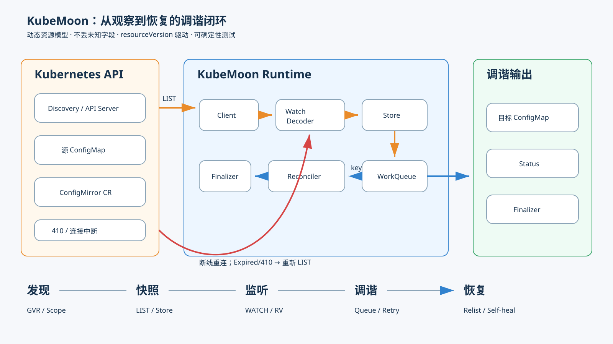

# KubeMoon

这是我基于 MoonBit 开发的 Kubernetes 动态客户端与 Controller Runtime。没有只给某个 YAML 操作包一层，而是补齐 Operator 真正依赖的那条长链：资源发现、动态对象、LIST/WATCH、缓存、去重队列、失败恢复与调谐。

> 当前源码版本为 `0.1.1`；已发布的 `0.1.0` 完成了 native 测试和 [kind 生命周期验收](https://github.com/cxh04/KubeMoon/actions/runs/36689826457)。动态客户端、原生 HTTP/TLS、分页 LIST/WATCH 恢复、Controller 队列和 ConfigMirror 调谐均可验证。我还在独立新项目中安装 `cxh04/kubemoon@0.1.0` 并通过 native 检查。



## 为什么 MoonBit 现在需要 Kubernetes Runtime

Kubernetes 客户端的难点不在发出一个 GET，而在长期运行后还能保持正确：WATCH 可能从任意字节处分块，连接会中断，resourceVersion 会过期，同一对象会在处理中再次变化。KubeMoon 把这些失败路径作为一等设计对象，并用纯状态机与虚拟时间把它们变成快速、确定的测试。

我选择动态资源模型，不要求使用者先生成 OpenAPI 强类型代码。`GroupVersionResource + Scope` 可以覆盖内置资源和 CRD，后续强类型层可在其上渐进构建。

## Discovery：先把目录和清单读准确

我现在可以解码 `/api` 的 core 版本目录、`/apis` 的 named group 目录，以及一份 `APIResourceList`（例如 core `v1` 或 `apps/v1`）。named group 解码保留服务端的 group 与 version 顺序，不替 API Server 排序或去重；`preferredVersion` 可以缺省，但一旦存在，就必须与组名一致并且出现在该组的 `versions` 中。

资源清单解码会保留 namespace 作用域、verbs、`singularName`、短名称、分类以及 `deployments/status` 这类子资源，但现在不会为子资源生成顶层 `GroupVersionResource`。目录或清单中的必需字段缺失、类型错误或版本关系不一致时，我拒绝整份结果，并用数组下标指出错误位置，避免动态客户端拿着半份目录继续工作。Discovery 请求现在可以交给真实 Transport 执行，但“发出请求—按端点选择解码器”的组合 API、缓存、刷新和 Aggregated Discovery v2 仍是后续开发项。

## 第一条真实网络路径

`httptransport` 基于 [`moonbitlang/async/http`](https://skills.mooncakes.io/docs/moonbitlang/async/http) 建立 native 连接，映射 KubeMoon 的五种请求方法、认证头与 JSON 请求体，并把完整响应读回现有 `Response`。同一执行器会复用连接；请求 URL 必须属于连接时指定的 API Server，避免携带 Bearer Token 的请求被误投到另一个 origin。

HTTPS 默认使用系统信任根；`ClientConfig.ca_file` 存在时改用该 PEM 文件作为专用信任根，正好对应 Pod 内挂载的 ServiceAccount CA。普通请求仍读取完整响应；WATCH 在独立连接上逐块返回原始字节，避免一个长期监听占住 CRUD 连接。`watch.ByteDecoder` 等到完整换行后才解码 UTF-8，字符恰好跨网络读取边界也不会损坏。

我用一个本地脚本化 HTTP Server 演示这条真实网络路径，不需要 Kubernetes 集群：

```bash
moon run examples/watch_once --target native
```

输出为两行：`BOOKMARK 12`、`ADDED 13`。这证明请求、独立连接、分块读取与事件解码可以组合；它尚不执行自动重连或资源调谐。非 2xx 响应的状态码和响应体由流接口保留，调用方需先处理状态，再将 2xx 响应体送入事件解码器。

## 一个事件如何穿过 KubeMoon

1. `resource` 为任意 GVR 生成 core/group、集群级/namespace 级路径。
2. `client` 加入认证、Accept 与不同 PATCH media type。
3. `watch.Decoder` 跨网络 chunk 缓存半条 JSON，只输出完整事件。
4. `reflector` 用 resourceVersion 更新 `store`；BOOKMARK 只推进进度。
5. `queue` 合并重复 key。处理期间再次变化时，只补一次调谐。
6. 失败进入有上限的指数退避；测试通过显式推进虚拟时钟，不 sleep。
7. 收到 `Expired/410` 时自动重新 LIST；LIST 分页收齐之前不替换缓存，正常断线则从最后的 resourceVersion 续传。

## 现在就能验证什么

```bash
moon fmt --check
moon check --target native --deny-warn --warn-list +73
moon test --target native
moon build cmd/configmirror --target native
moon run examples/watch_once --target native
```

测试覆盖 core/group 路径、APIVersions 与 APIGroupList 目录、APIResourceList 字段与错误边界、显式 Token 配置、CRUD 请求、Kubernetes Status 分类、任意分块事件、BOOKMARK、快照替换、重复版本、dirty key、退避复位及 410 relist。Fake Transport 会严格按脚本消费响应，脚本耗尽即失败，避免测试“凭空成功”。

## 在 kind 中验收 ConfigMirror

`cmd/configmirror` 使用 Pod 内 ServiceAccount Token 和 CA，监听 ConfigMirror 与 ConfigMap，按源内容创建或更新多个 namespace 的目标。它只会修改带有当前 CR UID 注解的目标；同名但不受管的 ConfigMap 会使 `Ready=False`，不会被覆盖。删除 CR 时，finalizer 等受管目标实际消失后才移除。

在 Linux、Docker、kind、kubectl 均可用的机器上运行 `bash tests/kind-e2e.sh`。脚本创建独立的 kind 集群，构建 native 镜像，安装 [CRD](deploy/configmirror-crd.yaml) 与 [Controller/RBAC](deploy/configmirror-controller.yaml)，验证双目标同步、源更新、目标删除自愈、Controller 重启及 finalizer 清理，最后删除它创建的集群。[GitHub Actions 的 kind 作业](https://github.com/cxh04/KubeMoon/actions/runs/36689826457)已验证这一流程。

## 故障恢复现场

- 相同 resourceVersion 重放：Store 不产生新工作。
- 处理中收到新事件：key 标记 dirty，完成后只追加一次。
- WATCH BOOKMARK：保存续传点，不触发 reconcile。
- `410 Gone / Expired`：离开 WATCH 循环，重新 LIST，而不是盲目重连旧版本。
- 429/5xx：结构化标记为可重试；普通 404/409 交给调谐逻辑判断。

## 声明质量边界

v0.1 不承诺 kubeconfig exec/OIDC、云厂商认证、OpenAPI 强类型生成、leader election、Admission Webhook 或 Wasm Operator Host。计划先把单 Controller 的正确性、恢复性和可复现性做扎实。

## 从 v0.1 到完整 Operator 生态

v0.1 的真实集群生命周期与新项目安装已经验证。当前实现只针对单实例 Controller：它以集群级 ConfigMap WATCH 识别源和目标变更，后续再缩小监听范围并增加共享 informer、多 Controller manager、leader election、代码生成与指标端点。

## 开发记录与许可证

提交遵循 Conventional Commits，正文记录实际验证命令。项目由我确定技术方向和质量边界，AI 的辅助范围见 [AI_ASSISTED.md](AI_ASSISTED.md)。

Apache-2.0 licensed. Copyright 2026 cxh04.
